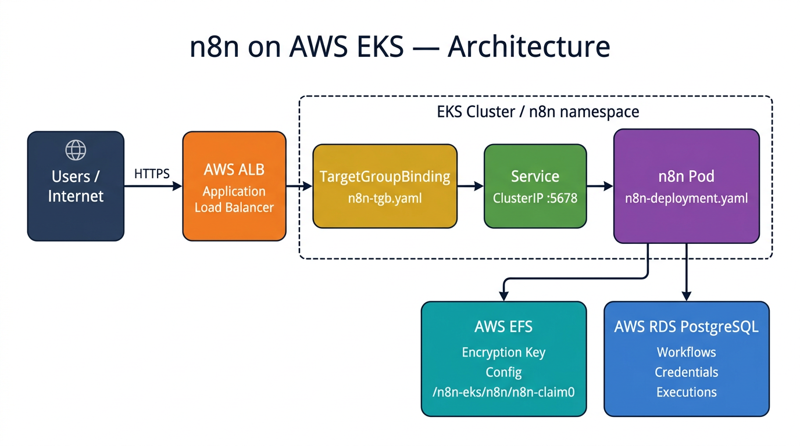
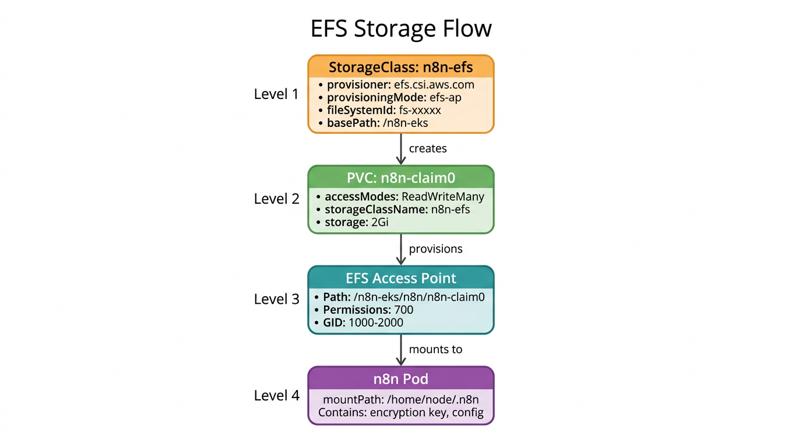
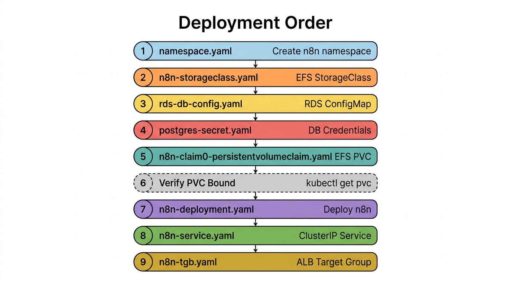

# n8n on AWS EKS - Complete Setup Guide

A comprehensive guide to deploy [n8n](https://n8n.io) workflow automation on AWS EKS with **EFS** for persistent storage and **RDS PostgreSQL** for the database, fronted by an **AWS ALB**.

---

## Architecture



| Layer | Component | Description |
|-------|-----------|-------------|
| **Ingress** | AWS ALB | Application Load Balancer terminates HTTPS |
| **Routing** | TargetGroupBinding | Routes ALB traffic to the n8n Kubernetes Service |
| **Service** | ClusterIP :5678 | Internal service exposing the n8n pod |
| **Application** | n8n Pod | Runs the n8n workflow engine |
| **Storage** | AWS EFS | Stores encryption key, config at /home/node/.n8n |
| **Database** | AWS RDS PostgreSQL | Stores workflows, credentials, executions, users |

---

## Prerequisites

### AWS Resources
- **EKS Cluster** running and accessible via kubectl
- **EFS File System** in the same VPC as EKS, with mount targets in node subnets
- **RDS PostgreSQL** in the same VPC, PostgreSQL v15 or v16
- **ALB** with a Target Group pointing to the EKS nodes
- **EFS CSI Driver** installed on the cluster ([install guide](https://docs.aws.amazon.com/eks/latest/userguide/efs-csi.html))
- **AWS Load Balancer Controller** installed on the cluster

### Tools
- kubectl configured for the EKS cluster
- aws CLI configured with appropriate permissions

### Verify EFS CSI Driver
```bash
kubectl get pods -n kube-system | grep efs
```
You should see efs-csi-controller and efs-csi-node pods running.

---

## File Structure

```
kubernetes/
|-- images/
|   |-- architecture-diagram.png
|   |-- efs-flow-diagram.png
|   |-- deployment-order.png
|-- namespace.yaml
|-- n8n-storageclass.yaml
|-- n8n-claim0-persistentvolumeclaim.yaml
|-- rds-db-config.yaml
|-- postgres-secret.yaml
|-- n8n-deployment.yaml
|-- n8n-service.yaml
|-- n8n-tgb.yaml
|-- README.md
|-- SETUP.md  (this file)
```

---

## Step 1 - Create the EFS File System

### 1.1 Create EFS in AWS
1. Go to **AWS Console > EFS > Create file system**
2. Select the **same VPC** as your EKS cluster
3. Under **Network**, ensure mount targets exist for **all subnets** where your EKS nodes run
4. After creation, note the **File System ID** (e.g. fs-0123456789abcdef0)

### 1.2 Configure EFS Security Group
Add an **inbound rule** to the EFS security group:

| Type | Protocol | Port | Source |
|------|----------|------|--------|
| NFS | TCP | 2049 | EKS Node Security Group |

### 1.3 Configure the StorageClass

Edit [n8n-storageclass.yaml](n8n-storageclass.yaml) and set your EFS file system ID:

```yaml
parameters:
  fileSystemId: fs-REPLACE_WITH_YOUR_EFS_ID
  basePath: "/n8n-eks"
```

### How EFS Storage Works



**StorageClass parameters explained:**

| Parameter | Value | What it does |
|-----------|-------|-------------|
| provisioningMode | efs-ap | Creates an EFS Access Point per PVC (isolated directory) |
| fileSystemId | fs-xxxxx | Your EFS file system ID |
| directoryPerms | 700 | Only the owner can read/write/execute |
| gidRangeStart/End | 1000-2000 | GID pool for access point isolation |
| basePath | /n8n-eks | Root directory on EFS for all n8n volumes |
| tags | Name=n8n-efs | Tags the Access Point in AWS Console |

**Resulting EFS path:** /n8n-eks/n8n/n8n-claim0

---

## Step 2 - Create the RDS PostgreSQL Instance

### 2.1 Create RDS in AWS
1. Go to **AWS Console > RDS > Create database**
2. Engine: **PostgreSQL** (v15 or v16 recommended)
3. **VPC**: Same as EKS cluster
4. **Public access**: Disabled
5. After creation, note the **Endpoint**

### 2.2 Configure RDS Security Group
Add an **inbound rule** to the RDS security group:

| Type | Protocol | Port | Source |
|------|----------|------|--------|
| PostgreSQL | TCP | 5432 | EKS Node Security Group |

### 2.3 Create the n8n Database and User

Connect to RDS as the master/admin user:
```bash
psql -h <YOUR_RDS_ENDPOINT> -U <MASTER_USER> -d postgres
```

Run the following SQL:
```sql
CREATE USER <YOUR_N8N_DB_USER> WITH PASSWORD '<YOUR_N8N_DB_PASSWORD>';
CREATE DATABASE "n8n-dev" OWNER <YOUR_N8N_DB_USER>;

\c n8n-dev

GRANT USAGE, CREATE ON SCHEMA public TO <YOUR_N8N_DB_USER>;
GRANT ALL PRIVILEGES ON ALL TABLES IN SCHEMA public TO <YOUR_N8N_DB_USER>;
GRANT ALL PRIVILEGES ON ALL SEQUENCES IN SCHEMA public TO <YOUR_N8N_DB_USER>;

ALTER DEFAULT PRIVILEGES IN SCHEMA public
  GRANT ALL PRIVILEGES ON TABLES TO <YOUR_N8N_DB_USER>;

ALTER DEFAULT PRIVILEGES IN SCHEMA public
  GRANT ALL PRIVILEGES ON SEQUENCES TO <YOUR_N8N_DB_USER>;
```

### Required Database Permissions Summary

| Permission | Why n8n needs it |
|-----------|-----------------|
| CONNECT | Basic DB connection |
| USAGE on schema | Access the public schema |
| CREATE on schema | n8n creates tables on first start |
| ALL ON TABLES | Read/write workflow data, credentials, executions |
| ALL ON SEQUENCES | Auto-increment IDs for rows |
| DEFAULT PRIVILEGES | n8n runs DB migrations on upgrades, new tables need access |

n8n does **not** need SUPERUSER or CREATEDB.

---

## Step 3 - Configure Kubernetes Manifests

### 3.1 RDS Connection Details

Edit [rds-db-config.yaml](rds-db-config.yaml):

```yaml
data:
  RDS_HOST: "<YOUR_RDS_ENDPOINT>"
  RDS_PORT: "5432"
  RDS_DATABASE: "n8n-dev"
```

### 3.2 RDS Credentials

Edit [postgres-secret.yaml](postgres-secret.yaml):

```yaml
stringData:
  POSTGRES_NON_ROOT_USER: <YOUR_N8N_DB_USER>
  POSTGRES_NON_ROOT_PASSWORD: <YOUR_N8N_DB_PASSWORD>
```

**WARNING:** Never commit real credentials to git. For production, use [Sealed Secrets](https://github.com/bitnami-labs/sealed-secrets), [AWS Secrets Manager](https://docs.aws.amazon.com/secretsmanager/), or [External Secrets Operator](https://external-secrets.io/).

### 3.3 ALB Target Group Binding

Edit [n8n-tgb.yaml](n8n-tgb.yaml):

```yaml
spec:
  targetGroupARN: arn:aws:elasticloadbalancing:<REGION>:<ACCOUNT_ID>:targetgroup/<TG_NAME>/<TG_ID>
```

Get your Target Group ARN from **AWS Console > EC2 > Target Groups > select your TG > copy ARN**.

### 3.4 n8n Domain Configuration

Edit [n8n-deployment.yaml](n8n-deployment.yaml) and update the domain:

```yaml
- name: N8N_HOST
  value: <YOUR_N8N_DOMAIN>
- name: WEBHOOK_URL
  value: https://<YOUR_N8N_DOMAIN>/
```

### 3.5 Namespace

[namespace.yaml](namespace.yaml) creates the n8n namespace. No changes needed.

### 3.6 PVC for EFS

[n8n-claim0-persistentvolumeclaim.yaml](n8n-claim0-persistentvolumeclaim.yaml) creates the EFS-backed PVC. No changes needed (it references the n8n-efs StorageClass).

### 3.7 n8n Service

[n8n-service.yaml](n8n-service.yaml) creates a ClusterIP service on port 5678. No changes needed.

---

## Step 4 - Deploy to Cluster



Apply all manifests **in this exact order**:

```bash
# Step 1: Create the n8n namespace
kubectl apply -f namespace.yaml

# Step 2: Create EFS StorageClass
kubectl apply -f n8n-storageclass.yaml

# Step 3: Create RDS ConfigMap (connection details)
kubectl apply -f rds-db-config.yaml

# Step 4: Create RDS credentials secret
kubectl apply -f postgres-secret.yaml

# Step 5: Create EFS PVC
kubectl apply -f n8n-claim0-persistentvolumeclaim.yaml

# Step 6: Wait for PVC to be Bound
kubectl get pvc -n n8n
# STATUS should show "Bound" before continuing

# Step 7: Deploy n8n application
kubectl apply -f n8n-deployment.yaml

# Step 8: Create ClusterIP service
kubectl apply -f n8n-service.yaml

# Step 9: Create ALB Target Group Binding
kubectl apply -f n8n-tgb.yaml
```

---

## Step 5 - Verify the Deployment

### 5.1 Check pods are running
```bash
kubectl get pods -n n8n
```
Expected output:
```
NAME                   READY   STATUS    RESTARTS   AGE
n8n-xxxxxxxxxx-xxxxx   1/1     Running   0          2m
```

### 5.2 Check PVC is bound to EFS
```bash
kubectl get pvc -n n8n
```
Expected output:
```
NAME         STATUS   VOLUME       CAPACITY   ACCESS MODES   STORAGECLASS   AGE
n8n-claim0   Bound    pvc-xxxxxx   2Gi        RWX            n8n-efs        5m
```

### 5.3 Check n8n logs for healthy startup
```bash
kubectl logs -n n8n -l service=n8n --tail=20
```
Healthy log output:
```
Initializing n8n process
n8n ready on ::, port 5678
Migrations in progress, please do NOT stop the process.
...all migrations finish...
Editor is now accessible via:
https://<YOUR_N8N_DOMAIN>
```

On **first run**, you will see "No encryption key found - Auto-generating". This is normal. The key is saved to EFS and reused on subsequent restarts.

### 5.4 Verify RDS connection
```bash
kubectl exec -n n8n -l service=n8n -- env | grep DB_POSTGRESDB
```
Verify DB_POSTGRESDB_HOST shows your RDS endpoint.

### 5.5 Verify EFS mount
```bash
kubectl exec -n n8n -l service=n8n -- ls -la /home/node/.n8n/
```
You should see a config file (contains the encryption key).

---

## Step 6 - Verify EFS Access Point

### Via AWS CLI
```bash
aws efs describe-access-points \
  --file-system-id <YOUR_EFS_ID> \
  --region <YOUR_REGION> \
  --query 'AccessPoints[*].{Name:Tags[?Key==`Name`]|[0].Value,Path:RootDirectory.Path,State:LifeCycleState}'
```
Expected: path /n8n-eks/n8n/n8n-claim0, state available.

### Via kubectl
```bash
kubectl get pvc n8n-claim0 -n n8n -o jsonpath='{.spec.volumeName}'
kubectl get pv <PV_NAME> -o yaml | grep volumeHandle
```
The volumeHandle contains the Access Point ID: fs-xxxxx::fsap-xxxxxxxxxxxxxxxxx

### Via AWS Console
1. Go to **EFS > File systems > your file system**
2. Click the **Access points** tab
3. You should see an access point with path /n8n-eks/n8n/n8n-claim0

---

## Step 7 - Access the n8n UI

Open your browser and go to:
```
https://<YOUR_N8N_DOMAIN>
```

On first visit, you will be prompted to create an **owner account**. This account is stored in RDS.

---

## Maintenance Guide

### Backup the Encryption Key (CRITICAL)

The n8n encryption key is stored on EFS at /home/node/.n8n/config. **Back it up immediately after first run:**

```bash
kubectl exec -n n8n -l service=n8n -- cat /home/node/.n8n/config
```

Store the output securely (AWS Secrets Manager, 1Password, etc.).

**If this key is lost, all saved credentials and encrypted data in n8n will be unrecoverable.**

### Connect to RDS Database

```bash
kubectl run psql-client --rm -it --restart=Never \
  -n n8n \
  --image=postgres:15 \
  --env="PGPASSWORD=<YOUR_N8N_DB_PASSWORD>" \
  -- psql -h <YOUR_RDS_ENDPOINT> \
          -U <YOUR_N8N_DB_USER> \
          -d n8n-dev
```

Useful queries inside psql:
```sql
SELECT id, email, "firstName", "lastName" FROM "user";
\dt
SELECT COUNT(*) FROM workflow_entity;
\q
```

### Scale Down / Up

```bash
kubectl scale deployment n8n -n n8n --replicas=0
kubectl scale deployment n8n -n n8n --replicas=1
```

### Update n8n Version

Edit [n8n-deployment.yaml](n8n-deployment.yaml) and update the image tag:
```yaml
image: n8nio/n8n:1.x.x
```
Then apply:
```bash
kubectl apply -f n8n-deployment.yaml
```

### View All Resources
```bash
kubectl get all -n n8n
kubectl get pvc -n n8n
kubectl get configmap -n n8n
kubectl get secret -n n8n
```

---

## Advanced: Changing the EFS Path

If you need to change the basePath in the StorageClass after deployment:

1. **Backup the encryption key**
   ```bash
   kubectl exec -n n8n -l service=n8n -- cat /home/node/.n8n/config
   ```

2. **Scale down n8n**
   ```bash
   kubectl scale deployment n8n -n n8n --replicas=0
   ```

3. **Delete the existing PVC**
   ```bash
   kubectl delete pvc n8n-claim0 -n n8n
   ```

4. **Delete and recreate the StorageClass** (parameters are immutable)
   ```bash
   kubectl delete storageclass n8n-efs
   ```
   Update basePath in [n8n-storageclass.yaml](n8n-storageclass.yaml), then:
   ```bash
   kubectl apply -f n8n-storageclass.yaml
   ```

5. **Recreate the PVC**
   ```bash
   kubectl apply -f n8n-claim0-persistentvolumeclaim.yaml
   ```

6. **Restore the encryption key** to the new EFS path using a temporary busybox pod that mounts the PVC, then write the config file.

7. **Scale n8n back up**
   ```bash
   kubectl scale deployment n8n -n n8n --replicas=1
   ```

---

## Troubleshooting

### PVC stuck in Pending
```bash
kubectl describe pvc n8n-claim0 -n n8n
```
- Verify EFS CSI driver is running: kubectl get pods -n kube-system | grep efs
- Verify fileSystemId in [n8n-storageclass.yaml](n8n-storageclass.yaml) is correct
- Verify EFS security group allows **NFS (TCP 2049)** from EKS nodes

### Pod stuck in Init or CrashLoopBackOff
```bash
kubectl describe pod -n n8n -l service=n8n
kubectl logs -n n8n -l service=n8n --previous
```
- Verify RDS security group allows **TCP 5432** from EKS nodes
- Verify credentials in [postgres-secret.yaml](postgres-secret.yaml) match the RDS user
- Verify RDS_HOST in [rds-db-config.yaml](rds-db-config.yaml) is correct

### X-Forwarded-For / trust proxy warning
Add this env var to [n8n-deployment.yaml](n8n-deployment.yaml):
```yaml
- name: N8N_PROXY_HOPS
  value: "1"
```
This tells n8n it sits behind one proxy (ALB) and to trust X-Forwarded-For headers.

### n8n cannot decrypt credentials after restart
The encryption key on EFS was lost or regenerated. Restore from backup:
```bash
kubectl exec -it -n n8n -l service=n8n -- sh
cat > /home/node/.n8n/config << 'EOF'
{"encryptionKey":"<YOUR_BACKED_UP_KEY>"}
EOF
exit
```
Then restart the pod:
```bash
kubectl rollout restart deployment n8n -n n8n
```

### StorageClass parameters cannot be updated
StorageClass parameters are **immutable** after creation. Delete and recreate:
```bash
kubectl delete storageclass n8n-efs
kubectl apply -f n8n-storageclass.yaml
```
Existing PVCs bound to the old StorageClass are not affected.

### PVC spec cannot be changed
PVC spec (accessModes, storageClassName) is **immutable** after creation. Delete and recreate:
```bash
kubectl scale deployment n8n -n n8n --replicas=0
kubectl delete pvc n8n-claim0 -n n8n
kubectl apply -f n8n-claim0-persistentvolumeclaim.yaml
kubectl scale deployment n8n -n n8n --replicas=1
```
Backup the encryption key before deleting the PVC.

---

## Quick Reference

### Files to edit before first deployment

| File | What to set |
|------|------------|
| [n8n-storageclass.yaml](n8n-storageclass.yaml) | fileSystemId - your EFS ID |
| [rds-db-config.yaml](rds-db-config.yaml) | RDS_HOST - your RDS endpoint |
| [postgres-secret.yaml](postgres-secret.yaml) | POSTGRES_NON_ROOT_USER / PASSWORD - RDS credentials |
| [n8n-tgb.yaml](n8n-tgb.yaml) | targetGroupARN - ALB Target Group ARN |
| [n8n-deployment.yaml](n8n-deployment.yaml) | N8N_HOST / WEBHOOK_URL - your domain |

### Deploy command (all-in-one)
```bash
kubectl apply -f namespace.yaml && \
kubectl apply -f n8n-storageclass.yaml && \
kubectl apply -f rds-db-config.yaml && \
kubectl apply -f postgres-secret.yaml && \
kubectl apply -f n8n-claim0-persistentvolumeclaim.yaml && \
kubectl apply -f n8n-deployment.yaml && \
kubectl apply -f n8n-service.yaml && \
kubectl apply -f n8n-tgb.yaml
```

### Health check
```bash
kubectl get pods -n n8n && kubectl get pvc -n n8n && kubectl logs -n n8n -l service=n8n --tail=5
```
